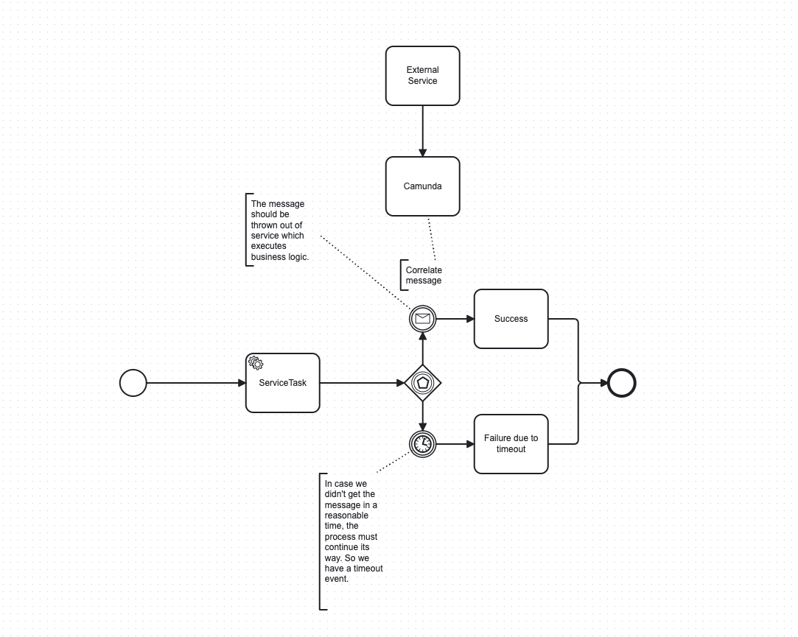

[](https://github.com/vrnsky/camunda-messaging-starter/actions/workflows/package.yml)
[](#)
[](#)
[](#)
[](#)

### ✉ Camunda Message Starter

Send a message to Camunda; it is a trivial task, but it brings a lot of boilerplate code.
By using this project you can save time.

### 〈〉Usage
```
<dependency>
  <groupId>io.vrnsky</groupId>
  <artifactId>camunda-messaging-starter</artifactId>
  <version>0.0.1-SNAPSHOT</version>
</dependency>
```

#### 🎉 Creation 
Template is created automatically. You don't need to create a bean.
But you can override the default template as below.

```java
import io.vrnsky.camunda.messaging.starter.CamundaMessageConfiguration;
import io.vrnsky.camunda.messaging.starter.CamundaMessageTemplate;
import org.springframework.context.annotation.Bean;
import org.springframework.context.annotation.Configuration;

@Configuration
public class MessageConfiguration {

    @Bean
    public CamundaMessageTemplate camundaMessageTemplate() {
        var camundaMessageConfiguration = new CamundaMessageConfiguration("http://localhost:8080");
        return new CamundaMessageTemplate(camundaMessageConfiguration);
    }
}
```

```java
import io.vrnsky.camunda.messaging.starter.CamundaMessageTemplate;
import io.vrnsky.camunda.messaging.starter.model.CamundaMessage;
import org.springframework.beans.factory.annotation.Autowired;
import org.springframework.web.bind.annotation.PostMapping;
import org.springframework.web.bind.annotation.RequestBody;
import org.springframework.web.bind.annotation.RestController;

@RestController
public class CamundaController {

    @Autowired
    private CamundaMessageTemplate camundaMessageTemplate;

    @PostMapping("/message")
    public void message(@RequestBody CamundaMessage camundaMessage) {
        camundaMessageTemplate.message(camundaMessage);
    }
}
```

#### Process definition example


#### Successfully launch

```bash
CamundaMessageTemplate   : baseUrl obtained from configs = http://localhost:8080
```

### ⨑ CI/CD

This project uses GitHub Actions for CI and CD; the [designated directory](./.github/workflows) contains all workflows.

### ✆ Contacts

[](https://vrnsky.medium.com)
[](https://vrnsky.substack.com)
[](https://vrnsky.github.io)
[](https://me.dm/@vrnsky)
